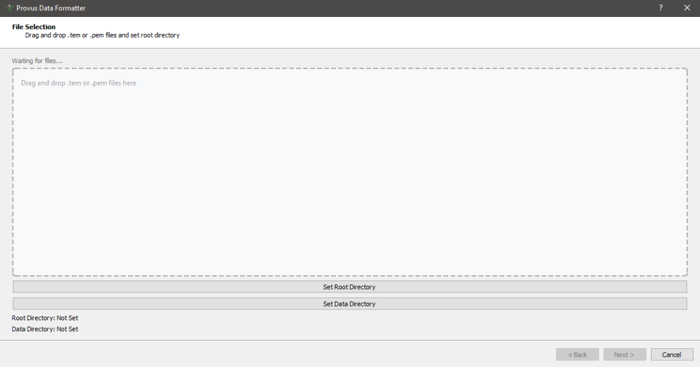

# Provus Formatter

A Python GUI application that will assist in brining data into provus projects


## Disclaimer

This tool is provided to assist with data formatting. Users are responsible for verifying the accuracy aof the generated waveform and sampling files for their specific data and requirements. Always maintain backups of original data files.


## Installation


### Download the installer ProvFormatter_setup.exe under releases tab, run the exe to install the program

## Usage

### Launch the Application

After installing by double clicking the setup.exe run the program

### Basic Workflow

 

1. **File Selection**
   - Set the root directory for output files (this would be your provus project folder)
   - Drag and drop TEM files into the application
   - click next


2. **Review waveform and sampling**
   - Review detected parameters in the table
   - Modify waveform, sampling, data style assignments if needed using the dropdown menus under the table
   - Preview and edit waveform shapes using the built-in waveform editor by DOUBLE CLICKING ON A ROW IN THE TABLE


3. **File Generation**
   - Click "Update Headers" to write waveform and sampling information to data files
   - Click "Update Project File" to create/update the Provus project file


### Output Structure

The tool creates the following directory structure in your root directory if it doesnt already exist.

```
root_directory/
├── Provus_Options/
│   ├── Waveforms/
│   │   ├── Square_5.200.csv
│   │   ├── UTEM_3.872.csv
│   │   └── ...
│   └── Channel_Sampling_Schemes/
│       ├── Square_5.200_14ch.csv
│       ├── UTEM_3.872_13ch.csv
│       └── ...
└── project.ppf
```

## File Formats

### Waveform Files
CSV format containing:
- Waveform name
- Base frequency
- Zero time
- Time-current pairs defining the waveform shape

### Channel Sampling Files
CSV format containing:
- Sampling scheme name
- Primary time gate
- Field type (B-field or dB/dt)
- Channel definitions (start time, end time, color coding)

## License

This project is licensed under the MIT License - see the LICENSE file for details.
